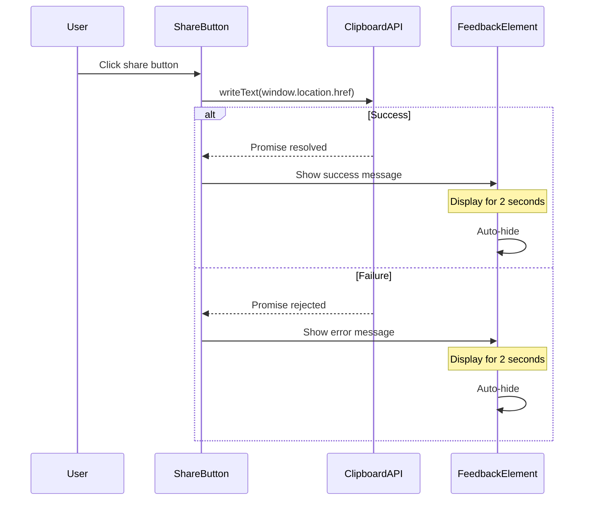

# Technical Design: Article Share Button

## Overview

**Purpose**: This feature enables readers to easily share blog articles by copying the article URL to their clipboard with a single click.

**Users**: Blog readers who want to share article links via messaging apps, email, or social media.

**Impact**: Extends the existing `article-component` with share functionality, adding a button element and clipboard interaction without architectural changes.

### Goals
- Provide one-click URL copying for article sharing
- Display clear visual feedback for copy success/failure
- Maintain accessibility standards (keyboard navigation, screen reader support)
- Follow existing UI patterns and Japanese text conventions

### Non-Goals
- Social media sharing integrations (direct post to Twitter/Facebook)
- URL shortening or custom share URLs
- Share analytics or tracking
- Native share dialog (Web Share API)

## Architecture

### Existing Architecture Analysis

The `article-component` is a self-contained Web Component using Shadow DOM:
- Renders markdown content via WASM parser
- Encapsulates styles within Shadow DOM
- Uses async `_render()` method for content generation
- Follows Japanese UI text pattern

**Integration Point**: The `_render()` method's template string will be extended to include the share button and feedback elements.

### Architecture Pattern & Boundary Map

**Architecture Integration**:
- Selected pattern: **In-component extension** - add functionality directly to existing component
- Domain boundary: Share functionality is article-specific, contained within `article-component`
- Existing patterns preserved: Shadow DOM encapsulation, async rendering, Japanese UI text
- New components rationale: None required - minimal extension approach
- Steering compliance: Follows "zero-dependency frontend" and "Web Components architecture" principles

### Technology Stack

| Layer | Choice / Version | Role in Feature | Notes |
|-------|------------------|-----------------|-------|
| Frontend | Vanilla JavaScript (ES Modules) | Click handler, state management | Existing stack |
| Browser API | Clipboard API (`navigator.clipboard.writeText`) | Copy URL to system clipboard | Baseline support in all modern browsers |
| Styling | Shadow DOM CSS | Button and feedback styling | Encapsulated within component |

## System Flows



## Requirements Traceability

| Requirement | Summary | Components | Interfaces | Flows |
|-------------|---------|------------|------------|-------|
| 1.1 | Display share button when article renders | ArticleComponent | _render() | - |
| 1.2 | SVG icon with text label | ArticleComponent | Button template | - |
| 1.3 | Visible positioning | ArticleComponent | CSS styles | - |
| 1.4 | Consistent styling | ArticleComponent | CSS styles | - |
| 2.1 | Copy URL on click | ArticleComponent | _handleShareClick() | Copy Flow |
| 2.2 | Use Clipboard API | ArticleComponent | navigator.clipboard | Copy Flow |
| 2.3 | Include full URL with query params | ArticleComponent | window.location.href | Copy Flow |
| 3.1 | Success confirmation message | ArticleComponent | _showFeedback() | Copy Flow |
| 3.2 | 2-second display duration | ArticleComponent | setTimeout | Copy Flow |
| 3.3 | Error message on failure | ArticleComponent | _showFeedback() | Copy Flow |
| 4.1 | Accessible label (aria-label) | ArticleComponent | Button attributes | - |
| 4.2 | Keyboard navigable | ArticleComponent | Native button element | - |
| 4.3 | Screen reader announcement | ArticleComponent | aria-live region | Copy Flow |

## Components and Interfaces

| Component | Domain/Layer | Intent | Req Coverage | Key Dependencies | Contracts |
|-----------|--------------|--------|--------------|------------------|-----------|
| ArticleComponent (extended) | UI | Render article with share functionality | 1.1-1.4, 2.1-2.3, 3.1-3.3, 4.1-4.3 | Clipboard API (P0) | State |

### UI Layer

#### ArticleComponent (Extended)

| Field | Detail |
|-------|--------|
| Intent | Display article content with share button for URL copying |
| Requirements | 1.1, 1.2, 1.3, 1.4, 2.1, 2.2, 2.3, 3.1, 3.2, 3.3, 4.1, 4.2, 4.3 |

**Responsibilities & Constraints**
- Render share button with SVG icon and text label after article content
- Handle click events to trigger clipboard copy operation
- Manage feedback message visibility state with auto-hide timer
- Maintain accessibility attributes for button and live region

**Dependencies**
- External: Clipboard API (`navigator.clipboard.writeText`) — copy URL to system clipboard (P0)
- External: `window.location.href` — source of article URL (P0)

**Contracts**: State [x]

##### State Management

```typescript
// Conceptual state (implemented as instance properties)
interface ShareButtonState {
  feedbackVisible: boolean;
  feedbackMessage: string;
  feedbackType: 'success' | 'error';
  feedbackTimeoutId: number | null;
}
```

- **State model**: Simple boolean for feedback visibility, message content, and type
- **Persistence**: None - ephemeral UI state only
- **Concurrency strategy**: Clear existing timeout before setting new one to prevent stale callbacks

##### Button Template Structure

```html
<div class="share-container">
  <button
    class="share-button"
    aria-label="記事のリンクをコピー"
    type="button"
  >
    <svg aria-hidden="true" width="16" height="16" viewBox="0 0 24 24" fill="none" stroke="currentColor" stroke-width="2">
      <path d="M10 13a5 5 0 0 0 7.54.54l3-3a5 5 0 0 0-7.07-7.07l-1.72 1.71" />
      <path d="M14 11a5 5 0 0 0-7.54-.54l-3 3a5 5 0 0 0 7.07 7.07l1.71-1.71" />
    </svg>
    <span>リンクをコピー</span>
  </button>
  <span class="share-feedback" role="status" aria-live="polite"></span>
</div>
```

##### Method Signatures

```typescript
// Click handler for share button
async _handleShareClick(): Promise<void>
// Preconditions: Button element exists in shadow DOM
// Postconditions: URL copied to clipboard OR error displayed
// Side effects: Shows feedback message, sets auto-hide timer

// Display feedback message
_showFeedback(message: string, type: 'success' | 'error'): void
// Preconditions: Feedback element exists in shadow DOM
// Postconditions: Message displayed, timer set for auto-hide
// Side effects: Clears any existing timeout

// Hide feedback message
_hideFeedback(): void
// Preconditions: Feedback element exists
// Postconditions: Feedback hidden, timeout cleared
```

**Implementation Notes**
- Integration: Add button template to existing `_render()` method after article content, before navigation link
- Validation: Check `navigator.clipboard` availability before attempting copy (graceful degradation)
- Risks: Clipboard API may fail if window loses focus during operation; wrap in try/catch

## Error Handling

### Error Strategy
All clipboard errors are caught and displayed to the user via the feedback mechanism.

### Error Categories and Responses

**User Errors**: None applicable - button click is always valid

**System Errors**:
- Clipboard API unavailable → Display "コピーに失敗しました" with guidance
- Permission denied → Display error message
- Window unfocused → Catch and display error

**Business Logic Errors**: None applicable

### Monitoring
Console logging for clipboard errors to aid debugging; no external monitoring required for this UI-only feature.

## Testing Strategy

### Unit Tests
- `_handleShareClick()` calls `navigator.clipboard.writeText()` with correct URL
- `_showFeedback()` displays message and sets correct CSS class
- `_hideFeedback()` removes message after timeout
- Timeout is cleared when new feedback shown

### Integration Tests
- Share button renders within article component
- Click triggers clipboard copy and shows success message
- Simulated clipboard failure shows error message
- Feedback auto-hides after 2 seconds

### E2E/UI Tests
- Share button visible on article page
- Clicking button copies URL to clipboard (verify via paste)
- Success message appears and disappears
- Button is keyboard accessible (Tab + Enter/Space)
