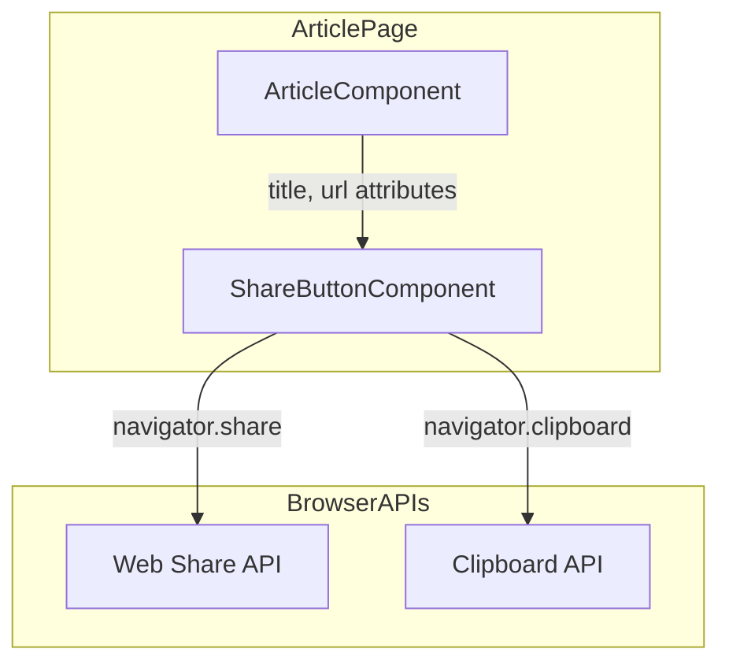
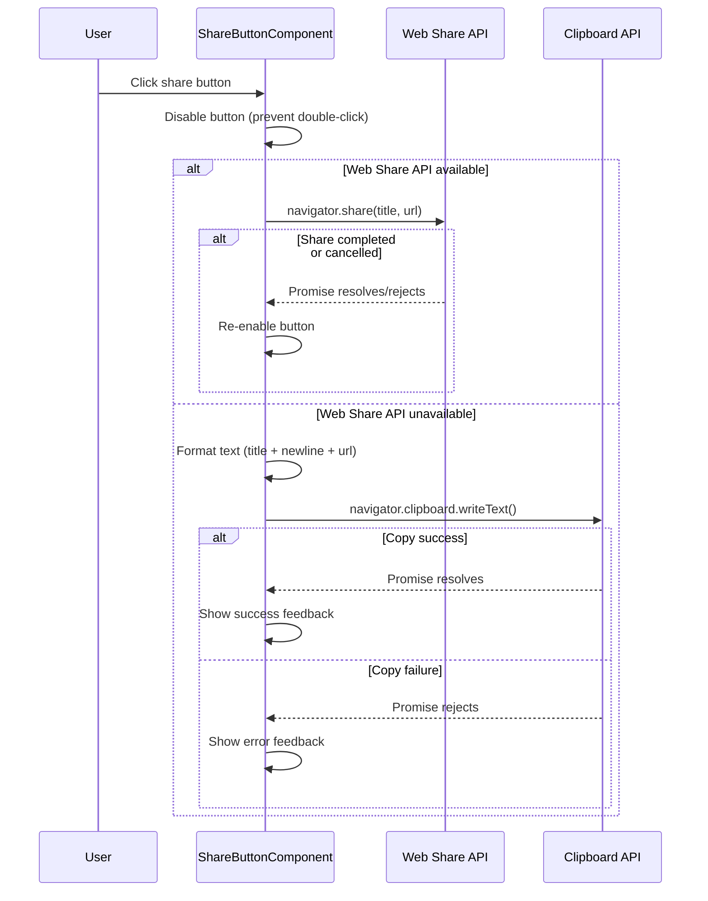

# Design Document

## Overview

**Purpose**: This feature enhances the share button to provide native sharing on supported platforms (via Web Share API) with clipboard copy as a fallback, enabling users to share article content more effectively across different devices and browsers.

**Users**: Blog readers viewing articles will use this feature to share articles with others through their preferred sharing method.

**Impact**: Modifies the existing `share-button-component.js` to add Web Share API support and updates `article-component.js` to pass the article title.

### Goals
- Enable native share dialog on mobile devices via Web Share API
- Maintain clipboard copy functionality for unsupported browsers
- Provide clear visual feedback for all share operations
- Follow existing Web Component patterns in the codebase

### Non-Goals
- Social media-specific share buttons (Twitter, Facebook, etc.)
- Share analytics or tracking
- Custom share text beyond title and URL

## Architecture

### Existing Architecture Analysis
- **Current Pattern**: `share-button-component.js` is a self-contained Web Component with Shadow DOM
- **Integration Point**: Component receives `url` attribute from parent, uses internal feedback system
- **Constraint**: Component must remain framework-agnostic (vanilla Web Components)
- **Technical Debt**: None identified; current implementation is clean

### Architecture Pattern & Boundary Map



**Architecture Integration**:
- Selected pattern: Component composition with attribute-based data passing
- Domain boundaries: ShareButtonComponent handles all share logic; ArticleComponent provides context
- Existing patterns preserved: Shadow DOM encapsulation, attribute-based configuration
- New components rationale: No new components; extending existing
- Steering compliance: Follows Web Components architecture, no external dependencies

### Technology Stack

| Layer | Choice / Version | Role in Feature | Notes |
|-------|------------------|-----------------|-------|
| Frontend | Vanilla JavaScript (ES Modules) | Component implementation | Existing stack |
| Browser API | Web Share API | Native share dialog | Feature-detected |
| Browser API | Clipboard API | Fallback copy mechanism | Already implemented |

## System Flows

### Share Button Click Flow



## Requirements Traceability

| Requirement | Summary | Components | Interfaces | Flows |
|-------------|---------|------------|------------|-------|
| 1.1 | Web Share API invocation | ShareButtonComponent | _handleShareClick | Share Flow |
| 1.2 | Clipboard fallback | ShareButtonComponent | _handleShareClick | Share Flow |
| 1.3 | Clipboard text format | ShareButtonComponent | _formatShareText | Share Flow |
| 1.4 | Error handling | ShareButtonComponent | _showFeedback | Share Flow |
| 2.1 | URL from current page | ShareButtonComponent | url getter | - |
| 2.2 | Title from page context | ShareButtonComponent, ArticleComponent | title attribute | - |
| 2.3 | Web Share API parameters | ShareButtonComponent | _handleShareClick | Share Flow |
| 2.4 | Clipboard text format | ShareButtonComponent | _formatShareText | - |
| 3.1 | Web Share dialog dismiss | ShareButtonComponent | _handleShareClick | Share Flow |
| 3.2 | Clipboard success feedback | ShareButtonComponent | _showFeedback | Share Flow |
| 3.3 | Error feedback | ShareButtonComponent | _showFeedback | Share Flow |
| 3.4 | Prevent duplicate clicks | ShareButtonComponent | _isProcessing flag | Share Flow |

## Components and Interfaces

| Component | Domain/Layer | Intent | Req Coverage | Key Dependencies | Contracts |
|-----------|--------------|--------|--------------|------------------|-----------|
| ShareButtonComponent | UI | Handle share/copy with hybrid approach | 1.1-1.4, 2.1-2.4, 3.1-3.4 | Web Share API (P1), Clipboard API (P0) | State |
| ArticleComponent | UI | Pass title to share button | 2.2 | ShareButtonComponent (P0) | - |

### UI Layer

#### ShareButtonComponent

| Field | Detail |
|-------|--------|
| Intent | Handle share button click with Web Share API or clipboard fallback |
| Requirements | 1.1, 1.2, 1.3, 1.4, 2.1, 2.2, 2.3, 2.4, 3.1, 3.2, 3.3, 3.4 |

**Responsibilities & Constraints**
- Primary: Execute share operation via appropriate API based on feature detection
- Boundary: Self-contained UI component with Shadow DOM encapsulation
- Invariants: Always provide user feedback; never leave button in disabled state indefinitely

**Dependencies**
- External: Web Share API — native share dialog (P1 - graceful degradation if unavailable)
- External: Clipboard API — text copy fallback (P0 - core functionality)

**Contracts**: State [x]

##### State Management
- State model:
  - `_isProcessing: boolean` — prevents duplicate clicks during async operations
  - `_feedbackTimeoutId: number | null` — tracks feedback auto-hide timer
- Persistence: None (transient UI state only)
- Concurrency: Single-threaded; button disabled during processing

##### Public Interface (Attributes)

```javascript
// Observed attributes
static get observedAttributes() {
  return ['url', 'title'];
}

// Attribute getters
get url(): string    // Returns attribute value or window.location.href
get title(): string  // Returns attribute value or document.title fallback
```

##### Internal Methods

```javascript
// Share operation handler
async _handleShareClick(): Promise<void>
// Preconditions: Button not currently processing
// Postconditions: Share attempted via Web Share API or clipboard; feedback shown
// Errors: Displays error feedback on failure

// Text formatting for clipboard
_formatShareText(title: string, url: string): string
// Returns: "{title}\n{url}"

// Feature detection
_supportsWebShare(): boolean
// Returns: true if navigator.share is available

// Feedback display (existing)
_showFeedback(message: string, type: 'success' | 'error'): void
_hideFeedback(): void
```

**Implementation Notes**
- Integration: Update `_handleShareClick` to check `_supportsWebShare()` first
- Validation: Handle empty title gracefully (use document.title or omit from clipboard)
- Risks: Web Share API may silently fail on some platforms; ensure cleanup in all paths

#### ArticleComponent

| Field | Detail |
|-------|--------|
| Intent | Pass article title to share-button-component via attribute |
| Requirements | 2.2 |

**Responsibilities & Constraints**
- Primary: Extract article title from parsed markdown and pass to share button
- Change scope: Minimal - add title attribute to share-button-component element

**Dependencies**
- Outbound: ShareButtonComponent — provides title context (P0)

**Implementation Notes**
- Integration: Add `title="${articleTitle}"` attribute in `_render()` method
- Validation: Ensure title is HTML-escaped to prevent XSS
- Risks: Title extraction depends on markdown parser output structure

## Error Handling

### Error Strategy
Use try-catch with user-friendly feedback messages. All errors are recoverable (button returns to enabled state).

### Error Categories and Responses
- **Web Share API Cancellation**: User cancelled share dialog → return to default state silently
- **Web Share API Error**: Share failed → show error feedback in Japanese
- **Clipboard API Error**: Copy failed → show error feedback in Japanese
- **Missing Title**: Graceful degradation → use URL only or document.title

## Testing Strategy

### Unit Tests
- `_supportsWebShare()` returns correct boolean based on navigator.share availability
- `_formatShareText()` correctly formats title and URL with newline separator
- `_handleShareClick()` calls appropriate API based on feature detection
- Title attribute getter falls back to document.title when attribute is empty

### Integration Tests
- Share button receives title attribute from article-component
- Feedback message displays correctly after clipboard copy
- Button remains functional after share dialog dismissal

### E2E Tests (Manual)
- Mobile: Native share dialog opens with correct title and URL
- Desktop: Clipboard contains correct formatted text after click
- Error state: Feedback displays when clipboard API fails (simulate by revoking permissions)
