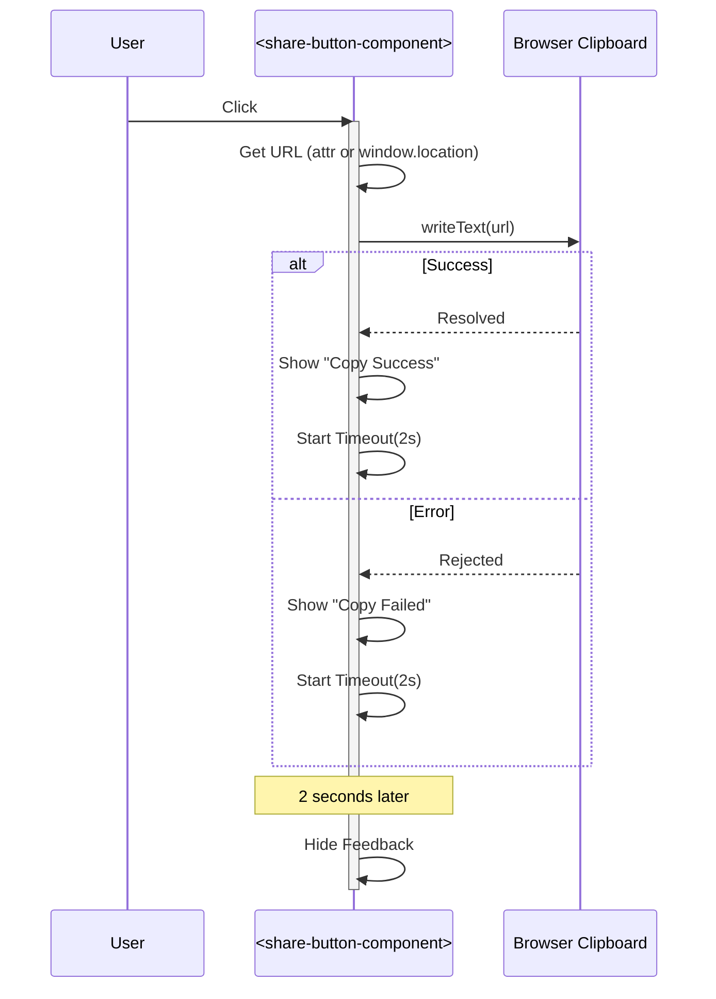

# Technical Design: Share Button Component

---
**Purpose**: Provide sufficient detail to ensure implementation consistency across different implementers, preventing interpretation drift.
---

## Overview
**Purpose**: This feature extracts the existing share button functionality into a reusable `share-button-component`.
**Users**: Developers can reuse the button across the application; Users get a consistent sharing experience.
**Impact**: Improves code maintainability by decoupling the share logic from the article renderer.

### Goals
- Create a standalone `share-button-component`.
- Replicate existing visual design and behavior (copy to clipboard, feedback toast).
- Allow URL configuration via attribute.
- Ensure zero regression in `article-component.js`.

### Non-Goals
- Changing the visual design of the button.
- Adding social media specific share actions (Twitter, Facebook, etc.).

## Architecture

### Architecture Pattern & Boundary Map
**Pattern**: Native Web Components (Custom Elements).
**Boundaries**:
- `ShareButtonComponent` encapsulates the UI and logic for the copy-to-clipboard action.
- Parent components (e.g., `ArticleComponent`) treat it as a black box, optionally providing a `url`.

### Technology Stack
| Layer | Choice / Version | Role in Feature | Notes |
|-------|------------------|-----------------|-------|
| Frontend | Vanilla JS (ES Modules) | Component Logic | No framework dependencies |
| Runtime | Browser DOM APIs | Clipboard, Shadow DOM | `navigator.clipboard`, `CustomElementRegistry` |

## Requirements Traceability

| Requirement | Summary | Components | Interfaces | Flows |
|-------------|---------|------------|------------|-------|
| 1.1, 1.2, 1.3, 1.4 | Component Definition | ShareButton | ES Module, Custom Element | Lifecycle |
| 2.1, 2.2, 2.3 | URL Configuration | ShareButton | `url` attribute | Attribute Change |
| 3.1, 3.2, 3.3, 3.4 | Visual Appearance | ShareButton | Shadow DOM CSS | Render |
| 4.1, 4.2, 4.3 | Clipboard Functionality | ShareButton | `navigator.clipboard` | User Interaction |
| 5.1, 5.2, 5.3, 5.4 | User Feedback | ShareButton | Internal State | Feedback Loop |
| 6.1, 6.2, 6.3, 6.4 | Accessibility | ShareButton | ARIA attributes | Keyboard Nav |
| 7.1, 7.2, 7.3, 7.4 | Article Integration | ArticleComponent | Composition | Integration |
| 8.1, 8.2 | Lifecycle Management | ShareButton | `disconnectedCallback` | Cleanup |

## Components and Interfaces

### Frontend Components

#### ShareButtonComponent

| Field | Detail |
|-------|--------|
| Intent | Encapsulate "copy URL" functionality and UI |
| Requirements | 1.x, 2.x, 3.x, 4.x, 5.x, 6.x, 8.x |
| Location | `app/scripts/components/share-button-component.js` |

**Responsibilities & Constraints**
- Render the button and feedback element within Shadow DOM.
- Handle click events to write to the clipboard.
- Manage the timer for feedback visibility.
- Clean up timers on disconnection.

**Dependencies**
- External: `navigator.clipboard` (Browser API) - Critical (P0)

**Contracts**
- **State**: Manages internal ephemeral state (`isShowingFeedback`, `feedbackType`).
- **API**: Configurable via HTML attributes.

##### Attribute Interface
| Attribute | Type | Default | Description |
|-----------|------|---------|-------------|
| `url` | string | `window.location.href` | The URL to be copied to the clipboard. |

##### Event Contract
- **Dispatches**: None (internal action only).
- **Listens**: `click` on the internal button element.

**Implementation Notes**
- **Integration**: The component must be defined with `customElements.define('share-button-component', ShareButtonComponent)`.
- **Validation**: Ensure `navigator.clipboard` is available (handle non-secure contexts gracefully with error feedback).
- **Styles**: Port CSS from `article-component.js`. ensuring `:host` block manages layout (e.g., `display: inline-block`).

#### ArticleComponent (Modification)

| Field | Detail |
|-------|--------|
| Intent | Display blog article |
| Requirements | 7.x |
| Location | `app/scripts/components/article-component.js` |

**Responsibilities & Constraints**
- Import `ShareButtonComponent`.
- Replace the `<button class="share-button">` and related logic with `<share-button-component>`.
- Pass the current article URL to the component (or rely on default if consistent).

**Implementation Notes**
- **Cleanup**: Remove `_handleShareClick`, `_showFeedback`, `_hideFeedback`, `_feedbackTimeoutId` from the class.
- **Cleanup**: Remove `.share-button`, `.share-feedback` styles from the `innerHTML` template.
- **Integration**: Update template to use `<share-button-component></share-button-component>`.

## System Flows

### Copy Flow

## Error Handling

### Error Strategy
- **Clipboard Errors**: If `writeText` fails (permission denied, not secure context), catch the error and display the "Copy failed" message to the user. Do not crash the component.

## Testing Strategy

### Unit Tests
- **Instantiation**: Verify element is defined and can be created.
- **Attributes**: Verify `url` attribute update changes the target URL.
- **Defaults**: Verify missing `url` attribute defaults to `window.location.href`.

### Integration Tests
- **Article Integration**: Verify the component renders correctly within `article-component` and retains styling/layout consistency.
